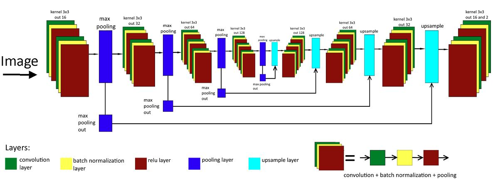
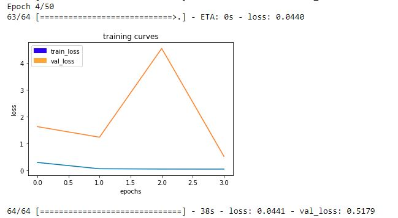
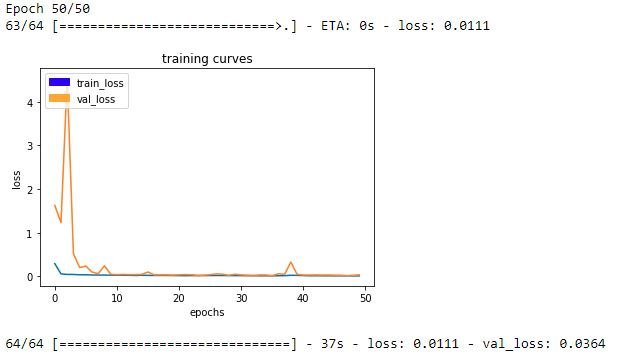

# Deep learning - Follow Me Project

## Introduction
This project is about training a fully-convolutional neural network to enable a drone to track and follow behind the "hero" target. In this report I will quickly go over network architecture used, training process and final results. It's been quite the struggle!

## Network Architecture 
Before this introduction to fully-convoluted networks, I used neural nets that proved to be a good way to achieve reasonable classfication models of entire pictures. 

When using a FCN, you can identify "where" in the image a certain object is. This is done by keeping spacial information through each pass of the filters. I followed the suggestions in the lectures and the project descriptions, and built a Fully Convolutional Network (FCN) to achieve the segmentation needed for the project.

The main building blocks of an FCN are the following:
- Convolutional Neural Network (CNN) with Encoder and Decoder constructed with seperable convolution layers
- 1x1 Convolution to connect the encoder and decoder
- Transposed convolutional layers for upsampling
- Skip connections
- max pooling and dropout

A general idea of one looks as such: 

<sub><sup>source : http://rnd.azoft.com/object-detection-fully-convolutional-neural-networks/</sup></sub>

### Encoder ###

The encoding stage exsists to extract features that will be useful for segmentation from the specific image. It does this via multiple layers that start by finding simple patterns in the first layer, and then gradually learns to understand more and more complex shapes/structures/feautures in each image the deeper the network goes. This is why I chose to do a 5 layer network; to allow it to increase the features it can find when presented with the training data. 

The Encoder in the FCN will essentially require separable convolution layers, due to its advantages as explained above.  
Below is the implementation for seperable_2d_batchnorm which includes ReLU activation applied to the layers to non-linearize the functions.

```python 
def separable_conv2d_batchnorm(input_layer, filters, strides=1):
    output_layer = SeparableConv2DKeras(filters=filters,kernel_size=3, strides=strides,
                             padding='same', activation='relu')(input_layer)
    
    output_layer = layers.BatchNormalization()(output_layer) 
    return output_layer

```

```python
def encoder_block(input_layer, filters, strides):
    
    # TODO Create a separable convolution layer using the separable_conv2d_batchnorm() function.
    output_layer = separable_conv2d_batchnorm(input_layer, filters, strides)
    
    return output_layer
```


### 1x1 Convolution ###

The 1x1 convolution layer in the FCN, however, is a regular convolution. Below is the implementation of the regular convolution with ReLU activation.

```python
def conv2d_batchnorm(input_layer, filters, kernel_size=3, strides=1):
    output_layer = layers.Conv2D(filters=filters, kernel_size=kernel_size, strides=strides, 
                      padding='same', activation='relu')(input_layer)
    
    output_layer = layers.BatchNormalization()(output_layer) 
    return output_layer
```
This 1x1 convolution layer seeks to implement the similar function as the fully-connected layer would, WHILE maintaining the spacial information. 


### Decoder ###

The 1x1 convolution connects to the decoder stage which then consists of multiple layers which up-scale the encoder output back to the same dimensions as the input image.

This bilinear up-sampling happens each layer. Upsampling by a factor of 2 is generally recommended: 
```python
def bilinear_upsample(input_layer):
    output_layer = BilinearUpSampling2D((2,2))(input_layer)
    return output_layer
```

```python
def decoder_block(small_ip_layer, large_ip_layer, filters):
    
    # TODO Upsample the small input layer using the bilinear_upsample() function.
    upsampled = bilinear_upsample(small_ip_layer)
    
    # TODO Concatenate the upsampled and large input layers using layers.concatenate
    concat_layer = layers.concatenate([upsampled, large_ip_layer])
    
    # TODO Add some number of separable convolution layers
    output_layer1 = separable_conv2d_batchnorm(concat_layer, filters)
    output_layer2 = separable_conv2d_batchnorm(output_layer1, filters)
    
    return output_layer2
```
The last part to the decoder section are the skip connections which connect some non-adjacent layers together. For instance, the output from the first encoder is connected directly to the input of the final decoder. This is done to retain some information that was lost during the encoding process. Doing this allows us to retain more accuracy and precision in the final segmentation. 

Once the network passes the last decoder stage, there is a convolutional output layer with a softmax activation to make the final pixel-wise segmentation between the 3 classes. 


### Final fully-connected NN architecture ###

My FNC features 5 encoder layers and 5 decoder layers. Inside the decoder, there are 2 seperable convolution layers after the upsampling and concatenation steps (as shown above in the code). This was found to be an optimal number of layers to test with seeing as that I do not have the most up to date GPU to run deeper networks with greater batch sizes.  

```python
def fcn_model(inputs, num_classes):
    
    # TODO Add Encoder Blocks. 
    # Remember that with each encoder layer, the depth of your model (the number of filters) increases.
    x1 = encoder_block(inputs, 16, 2)
    x2 = encoder_block(x1, 32, 2)
    x3 = encoder_block(x2, 64, 2)
    x4 = encoder_block(x3, 128, 2)
    x5 = encoder_block(x4, 256, 2)
    
    # TODO Add 1x1 Convolution layer using conv2d_batchnorm().
    x5_5 = conv2d_batchnorm(x5,256,kernel_size=1)
    
    # TODO: Add the same number of Decoder Blocks as the number of Encoder Blocks
    x = decoder_block(x5_5, x4, 256)
    x = decoder_block(x, x3, 128)
    x = decoder_block(x, x2, 64)
    x = decoder_block(x, x1, 32)
    x = decoder_block(x, inputs, 16)
    
    # The function returns the output layer of your model. "x" is the final layer obtained from the last decoder_block()
    return layers.Conv2D(num_classes, 1, activation='softmax', padding='same')(x)
```

### Tuning Hyperparameters ###

#### Learning rate
I tried different learning rates, but they either overtrained, or trained very, very slow and would not end providing a good model. In the end the recommended learning rate for the Adam optimiser ended up being `0.005`. 

#### Batch size
This number should be as high as your system can handle. If I had a better GPU I would have chosen something like `128/256`,but my GPU could only handle a batch size of around ~45. I chose to use 32, to give it a speed increase and have a nicer number to work with.

#### Steps per epoch
The formula is usually : `number of images to train on / divided by the batch size` . So I chose numbers between 45 -100. I ended up with 50 meeting requirements for my model.

#### Validation steps per epoch
Same as with steps per epoch, only related to number of images to validate on. I turned out to have better results with more steps. This number ended up being 64.

#### Number of epochs
This is the number of times you want the training to run. One must balance it between not training enough and overtraining. The right balance gives us the best performing model, in it's most general form. With the size of my model and the learning rate, I ended up running the training for 50 epochs.

#### Workers
This is the number of parallel processes during training. I tried different values here, but could not find any significant differences. So I picked 10 with the intention of speeding up the training.


### Result
The result of these hyper parameters gave the learning loss are shown in the figure below. As the figure shows the loss jumps up and down a bit, and even indicates overlearning. This can be much better if I provided more validation data, and also optimized the Adam optimizer more.

This is how the model started: 




After 50 epochs: 




The resulting IoU (Intersection of union) score is 41%. Over the required threshold of 40%.
A video from the follow mode can be found at : https://www.youtube.com/watch?v=x8wavJLAT5k

## Improvements
#### Tensorflow implementation
I could rewrite the project to use tensorflow, which could potentially improve the speed of training. This would allow me to test more models and hyperparameters. This would be very possible since Keras can use tensorflow as its backend.

#### Use AWS 
I could have used AWS if I wanted to train with higher batch sizes. I decided not to, as my computer was able to withstand the punishment I gave to it.

#### MORE DATA
Simply put, you can never have enough data. 

## Summary 
In all, this project really showed me how much time it takes to optimize hyperparameters and the uncertainty that comes with it. Deeplearning is still in its infant stage, and I look forward to seeing the differences a few more years of developement will provide. 


